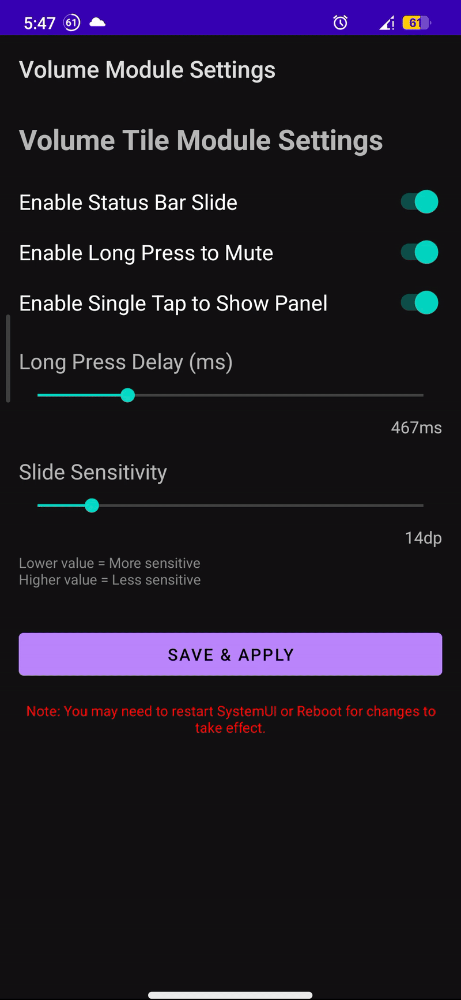

This is my first project in Kotlin :D

This is an LSPosed module that adds a Volume Control tile to the Quick Settings panel.
Useful when you have broken volume buttons.
That's it! 

## Features
- Single tap on the status bar to open the volume panel
- Long-press on the status bar to toggle media mute
- Left/right swipe on the status bar to decrease/increase volume
- A simple UI app to control and toggle all features as needed

